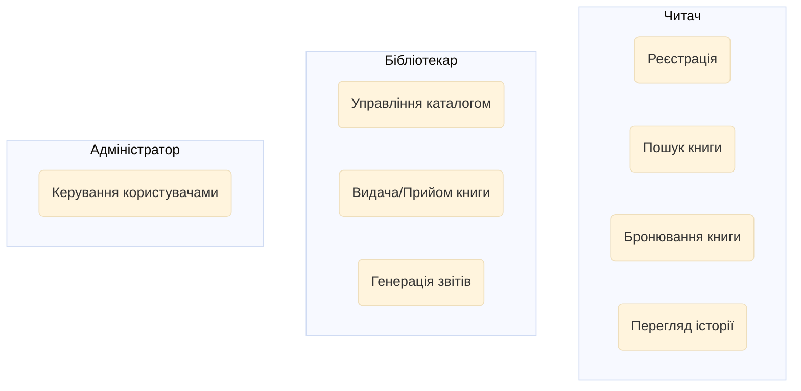

# Розділ 5. User Stories у UML-нотації

Нижче наведено UML-діаграми випадків використання для системи.

```mermaid
%%{init: {'theme':'base'}}%%
flowchart TB
    subgraph Читач
        US1(Реєстрація)
        US2(Пошук книги)
        US3(Бронювання книги)
        US4(Перегляд історії)
    end
    subgraph Бібліотекар
        US5(Управління каталогом)
        US6(Видача/Прийом книги)
        US7(Генерація звітів)
    end
    subgraph Адміністратор
        US8(Керування користувачами)
    end
```